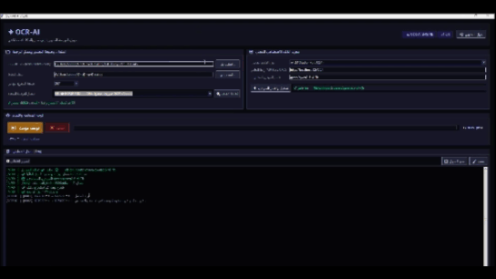

<div align="center">

# 🎬 OCR-AI Studio (v1.0.0)

**محرك تفريغ وتحويل الترجمات الصورية والنصية المتقدم برؤية الذكاء الاصطناعي**  
*Advanced AI-Powered Subtitle Extraction & Vision OCR Engine*

[](https://www.python.org/)
[](LICENSE)
[](https://www.microsoft.com/windows)
[](https://lmstudio.ai/)

---

### 📺 المعاينة والتجربة المباشرة (Visual Demo)



[](https://youtu.be/fekpXI--iec)

▶ **[اضغط هنا لمشاهدة فيديو الشرح التفصيلي على YouTube](https://youtu.be/fekpXI--iec)**

---

</div>

## 🌟 الميزات الرئيسية (Key Features)

| الميزة | الوصف والتفاصيل |
| :--- | :--- |
| ⚡ **استخراج نصي فوري** | كشف المسارات النصية (`SubRip SRT`, `ASS`, `VTT`) واستخراجها في أقل من ثانية بدون استهلاك AI. |
| 👁️ **كشف موديلات الرؤية** | التعرف التلقائي وترتيب الموديلات التي تدعم الصور (`Qwen2.5-VL`, `LLaVA`, `Llama-3.2-Vision`). |
| 🤖 **تكامل المحركات المحلية** | دعم التبديل بنقرة واحدة بين **LM Studio** (`Port 1234`) و **Ollama** (`Port 11434`). |
| ⏸️ **توقف مؤقت واستئناف** | حفظ تلقائي للجلسات في كاش `.cache` لمنع فقدان البيانات أثناء التوقف أو الإيقاف. |
| 📄 **تصدير متعدد الصيغ** | دعم التصدير التلقائي لصيغ `SRT`, `WebVTT (.vtt)`, `ASS (.ass)`, و `TXT (.txt)`. |
| 🛡️ **فحص الأخطاء المبكر** | تنبيه ذكي قبل المعالجة في حال نسيان تشغيل خادم LM Studio أو Ollama. |

---

## 🤖 الموديلات الموصى بها (Recommended Vision Models)

> [!TIP]
> للحصول على أفضل دقة في استخراج النصوص العربية والإنجليزي من الصور، نوصي بالموديلات التالية:

* **`Qwen2.5-VL-7B-Instruct`** *(الخيار الأفضل والأدق عالمياً)*
* **`Qwen2-VL-2B-Instruct`** *(الأسرع والأخف لكروت الشاشة المتوسطة)*
* **`Llama-3.2-11B-Vision-Instruct`** *(موديل Meta الرسمي)*
* **`Llava-v1.6-Vicuna-7B`** *(الموديل الكلاسيكي المستقر)*

---

## 💻 طريقة التثبيت والتشغيل (Quick Start & Installation)

### 1️⃣ التشغيل المباشر عبر السكربتات (1-Click Launchers):
1. انقر مرتين على `setup_env.bat` لتثبيت البيئة الافتراضية والحزم المطلوبة تلقائياً.
2. انقر مرتين على `run_app.bat` أو `main.pyw` لتشغيل الواجهة فوراً.

### 2️⃣ التشغيل عبر سطر الأوامر (Terminal):
```bash
# تثبيت المتطلبات
pip install -r requirements.txt

# تشغيل التطبيق
python main.pyw
```

---

## 🏛️ هيكل المشروع (Project Architecture)

```
OCR-AI-sub-mks/
│
├── 📁 core/                     # حزمة محركات الذكاء الاصطناعي وFFmpeg والـ OCR
├── 📁 gui/                      # حزمة الواجهة الرسومية والتصميم (App + Styles)
├── 📁 utils/                    # حزمة الإعدادات والإصدار (Config + Version)
├── 📁 img/                      # الوسائط والصور التوضيحية (Demo GIF)
│
├── 📄 config.json               # ملف الإعدادات المحفوظة
├── 🚀 main.py                   # مدخل النظام الرئيسي
├── 🎬 main.pyw                  # مدخل التشغيل بدون نافذة أسود
├── ⚡ run_app.bat               # سكربت التشغيل السريع
├── 🛠️ setup_env.bat             # سكربت التثبيت والتهيئة
└── 📜 README.md                 # التوثيق الشامل للمشروع
```

---

## 📜 الترخيص (License)
هذا المشروع مرخص بموجب رخصة **[MIT License](LICENSE)**.
